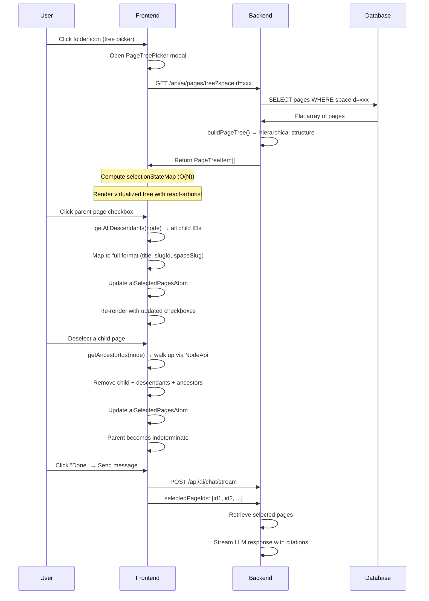

# AI Page Tree Selection - Technical Specification

**Docmost** - Collaborative Wiki & Documentation Software  
**Version:** 1.0  
**Last Updated:** March 1, 2026

---

## Table of Contents

1. [Overview](#overview)
2. [Architecture](#architecture)
3. [Tech Stack](#tech-stack)
4. [Data Flow](#data-flow)
5. [Component Details](#component-details)
6. [State Management](#state-management)
7. [API Specification](#api-specification)
8. [Database Schema](#database-schema)
9. [Selection Logic](#selection-logic)
10. [Performance Optimization](#performance-optimization)

---

## Overview

### Purpose

The AI Page Tree Selection feature provides a hierarchical, multi-select interface for choosing workspace pages as RAG context. Users can select entire page branches with automatic child selection, ensuring comprehensive context inclusion for AI chat.

### Key Capabilities

| Feature | Description |
|---------|-------------|
| **Hierarchical Tree Display** | Visual tree structure showing parent-child page relationships |
| **Auto-Select Children** | Selecting a parent automatically selects all descendant pages |
| **Smart Deselection** | Deselecting a child removes ancestors to prevent inconsistent states |
| **Indeterminate States** | Partial selections shown with ⬜ checkboxes |
| **Virtualized Rendering** | Handles 1000+ pages smoothly with react-arborist |
| **O(1) Performance** | Selection state map enables instant lookups during scrolling |
| **Full Data Mapping** | Complete page data preserved (title, slugId) for instant UI rendering |

---

## Architecture

### High-Level Diagram

```
┌─────────────────────────────────────────────────────────────────────────┐
│                           FRONTEND (React)                               │
├─────────────────────────────────────────────────────────────────────────┤
│  ┌──────────────┐  ┌──────────────┐  ┌──────────────┐                  │
│  │PageTreePicker│  │AiMessageInput│  │ useAiChat    │                  │
│  │              │  │              │  │              │                  │
│  │ - Tree modal │  │ - Toolbar    │  │ - Send pages │                  │
│  │ - react-arborist│ - Badges    │  │              │                  │
│  └──────┬───────┘  └──────┬───────┘  └──────┬───────┘                  │
│         │                 │                 │                           │
│         └─────────────────┼─────────────────┘                           │
│                           │                                             │
│                    ┌──────▼───────┐                                     │
│                    │ Jotai Atoms  │                                     │
│                    │ - aiSelectedPagesAtom │                            │
│                    │ - selectionStateMap     │                            │
│                    └──────┬───────┘                                     │
└───────────────────────────┼─────────────────────────────────────────────┘
                            │ HTTP
┌───────────────────────────▼─────────────────────────────────────────────┐
│                         BACKEND (NestJS)                                 │
├─────────────────────────────────────────────────────────────────────────┤
│  ┌──────────────────────────────────────────────────────────────────┐   │
│  │                    AiController                                   │   │
│  │  GET  /api/ai/pages/tree     - Fetch hierarchical page tree      │   │
│  │  POST /api/ai/pages/search   - Search pages by ID/query          │   │
│  └──────────────────────────────────────────────────────────────────┘   │
│                            │                                             │
│                            ▼                                             │
│                    ┌─────────────┐                                     │
│                    │  PageRepo   │                                     │
│                    │             │                                     │
│                    │ - getPagesBySpace()                             │
│                    │ - buildPageTree()                               │
│                    └──────┬──────┘                                     │
└───────────────────────────┼─────────────────────────────────────────────┘
                            │
┌───────────────────────────▼─────────────────────────────────────────────┐
│                      DATABASE (PostgreSQL)                               │
├─────────────────────────────────────────────────────────────────────────┤
│  ┌──────────────┐                                                      │
│  │    pages     │                                                      │
│  │              │                                                      │
│  │ - id         │                                                      │
│  │ - title      │                                                      │
│  │ - parentPageId (self-referencing FK)                              │
│  │ - spaceId    │                                                      │
│  │ - position   │                                                      │
│  └──────────────┘                                                      │
│                                                                              │
│  Hierarchy: parentPageId → pages.id (self-referencing)                     │
└─────────────────────────────────────────────────────────────────────────┘
```

---

## Tech Stack

### Frontend

| Technology | Version | Purpose |
|------------|---------|---------|
| **React** | 18.3.1 | UI framework |
| **TypeScript** | 5.7.2 | Type safety |
| **react-arborist** | 3.4.0 | Virtualized tree component |
| **Jotai** | 2.16.2 | Global state management |
| **@tanstack/react-query** | 5.90.17 | Data fetching & caching |
| **Mantine Core** | 8.3.14 | UI component library |

### Backend

| Technology | Version | Purpose |
|------------|---------|---------|
| **NestJS** | 11.x | Backend framework |
| **TypeScript** | 5.7.2 | Type safety |
| **Kysely** | Latest | Type-safe SQL query builder |
| **PostgreSQL** | 16+ | Database |
| **class-validator** | Latest | DTO validation |

---

## Data Flow

### Complete Selection Flow



---

## Component Details

### Frontend Components

| Component | File | Responsibility |
|-----------|------|----------------|
| `PageTreePicker` | `apps/client/src/features/ai/components/PageTreePicker.tsx` | Modal with hierarchical tree, handles selection logic |
| `PageTreePicker.module.css` | `apps/client/src/features/ai/components/PageTreePicker.module.css` | Custom scrollbar styling for react-arborist tree |
| `AiMessageInput` | `apps/client/src/features/ai/components/AiMessageInput.tsx` | Toolbar integration, badge display, tree picker trigger |
| `usePageTreeSelection` | `apps/client/src/features/ai/hooks/use-page-tree-selection.ts` | Selection state computation with O(1) lookup map |
| `page-tree-utils` | `apps/client/src/features/ai/utils/page-tree-utils.ts` | Helper functions: getAllDescendants, getAncestorIds |

### Backend Components

| Component | File | Responsibility |
|-----------|------|----------------|
| `AiController` | `apps/server/src/ai/ai.controller.ts` | GET /api/ai/pages/tree endpoint |
| `PageRepo` | `apps/server/src/database/repos/page/page.repo.ts` | getPagesBySpace(), buildPageTree() |
| `GetPageTreeDto` | `apps/server/src/ai/dto/ai-page-tree.dto.ts` | DTO validation for tree endpoint |

---

## UI/UX Styling

### Modal Structure

**Pattern:** Uses `Modal.Root` for explicit control over layout and padding, consistent with Settings modal.

```tsx
<Modal.Root
  opened={opened}
  onClose={onClose}
  size="md"
  yOffset="10vh"
  xOffset={0}
  padding="lg"
>
  <Modal.Overlay />
  <Modal.Content style={{ overflow: 'hidden' }}>
    <Modal.Header>
      <Modal.Title>Select Pages for Context</Modal.Title>
      <Modal.CloseButton />
    </Modal.Header>
    <Modal.Body style={{ display: 'flex', flexDirection: 'column', height: '80vh' }}>
      {/* Content */}
    </Modal.Body>
  </Modal.Content>
</Modal.Root>
```

**Benefits:**
- Explicit control over padding, header, and body layout
- Better structural control than simple `<Modal>` component
- Consistent with other modals in the application

### Dynamic Height Calculation

**Problem:** Fixed height doesn't adapt to screen size or modal layout.

**Solution:** Use ResizeObserver to measure container and pass to Tree.

```tsx
const treeContainerRef = useRef<HTMLDivElement>(null);
const [treeHeight, setTreeHeight] = useState(500);

useEffect(() => {
  if (!treeContainerRef.current) return;
  const observer = new ResizeObserver(([entry]) => {
    setTreeHeight(entry.contentRect.height);
  });
  observer.observe(treeContainerRef.current);
  return () => observer.disconnect();
}, []);
```

**Result:**
- Tree always fills available modal space
- Adapts to different screen sizes
- No hardcoded pixel values

### Custom Scrollbar Styling

**File:** `PageTreePicker.module.css`

**Problem:** react-arborist's internal scrollbar uses OS default (thick, positioned away from edge).

**Solution:** Target react-arborist's internal scrollbar with CSS module.

```css
/* Target the scroll container react-arborist renders internally */
.treeContainer :global(::-webkit-scrollbar) {
  width: 5px;
}

.treeContainer :global(::-webkit-scrollbar-thumb) {
  background-color: var(--mantine-color-gray-4);
  border-radius: 4px;
}

.treeContainer :global(::-webkit-scrollbar-thumb:hover) {
  background-color: var(--mantine-color-gray-5);
}

.treeContainer :global(::-webkit-scrollbar-track) {
  background: transparent;
}

/* Firefox scrollbar support */
.treeContainer {
  scrollbar-width: thin;
  scrollbar-color: var(--mantine-color-gray-4) transparent;
}
```

**Key Points:**
- Uses `:global()` to target react-arborist's internal DOM
- Reduced width from default ~15px to 5px
- Hover effect for better visibility
- Cross-browser support (Webkit + Firefox)
- **Critical:** Do NOT wrap Tree in ScrollArea - it owns its scrollbar

**Application:**
```tsx
<Box
  ref={treeContainerRef}
  flex={1}
  className={classes.treeContainer}
  style={{ overflow: 'hidden' }}
>
  <Tree
    data={treeData}
    height={treeHeight}
    // ...
  >
    {NodeRenderer}
  </Tree>
</Box>
```

---

## State Management

### Jotai Atoms

```typescript
// apps/client/src/features/ai/store/ai.atoms.ts

// Selected pages for AI chat (user explicitly selected for context)
export const aiSelectedPagesAtom = atom<AiPageSearchResult[]>([]);

// Each page contains:
interface AiPageSearchResult {
  pageId: string;    // Page UUID
  title: string;     // Page title (instant badge rendering)
  slugId: string;    // URL slug
  spaceId: string;   // Space UUID
  spaceSlug: string; // Space slug for URL construction
}
```

### Selection State Map

```typescript
// apps/client/src/features/ai/hooks/use-page-tree-selection.ts

// Computed once when treeData or selectedPages change
const selectionState = new Map<string, NodeSelectionState>();

interface NodeSelectionState {
  selected: boolean;      // Fully selected
  indeterminate: boolean; // Partially selected
}

// O(1) lookup during rapid virtualized scrolling
const state = selectionState.get(nodeId);
```

---

## API Specification

### Get Page Tree

**Endpoint:** `GET /api/ai/pages/tree`

**Query Parameters:**
| Parameter | Type | Required | Description |
|-----------|------|----------|-------------|
| `spaceId` | UUID | Yes | Space ID to fetch pages from |

**Response:** `PageTreeItem[]`

```typescript
interface PageTreeItem {
  id: string;              // Page UUID
  title: string | null;    // Page title
  icon: string | null;     // Page icon emoji
  slugId: string;          // URL slug
  spaceId: string;         // Space UUID
  parentPageId: string | null;  // Parent page UUID
  children: PageTreeItem[]; // Nested children
}
```

**Example Request:**
```http
GET /api/ai/pages/tree?spaceId=550e8400-e29b-41d4-a716-446655440000
```

**Example Response:**
```json
[
  {
    "id": "550e8400-e29b-41d4-a716-446655440001",
    "title": "Documentation",
    "icon": "📚",
    "slugId": "documentation",
    "spaceId": "550e8400-e29b-41d4-a716-446655440000",
    "parentPageId": null,
    "children": [
      {
        "id": "550e8400-e29b-41d4-a716-446655440002",
        "title": "Getting Started",
        "icon": "🚀",
        "slugId": "getting-started",
        "spaceId": "550e8400-e29b-41d4-a716-446655440000",
        "parentPageId": "550e8400-e29b-41d4-a716-446655440001",
        "children": []
      }
    ]
  }
]
```

---

## Database Schema

### Pages Table

```sql
CREATE TABLE pages (
  id              UUID PRIMARY KEY DEFAULT gen_uuid_v7(),
  workspace_id    UUID NOT NULL REFERENCES workspaces(id),
  space_id        UUID NOT NULL REFERENCES spaces(id),
  parent_page_id  UUID REFERENCES pages(id),  -- Self-referencing FK
  title           VARCHAR(255),
  icon            VARCHAR(255),
  slug_id         VARCHAR(255) UNIQUE,
  position        VARCHAR(255),
  created_at      TIMESTAMPTZ DEFAULT NOW(),
  updated_at      TIMESTAMPTZ DEFAULT NOW(),
  deleted_at      TIMESTAMPTZ
);

-- Indexes for hierarchy queries
CREATE INDEX idx_pages_space_parent ON pages(space_id, parent_page_id);
CREATE INDEX idx_pages_position ON pages(space_id, position);
```

**Self-Referencing Relationship:**
```
pages.id (PK)
  ↓
pages.parent_page_id (FK → pages.id)
```

This creates the hierarchical structure where a page can have children (other pages that reference it as their parent).

---

## Selection Logic

### 1. Parent Selection → Auto-Select Children

```typescript
const handleSelectPage = (node: NodeApi<PageTreeItem>, isSelected: boolean) => {
  const rawData = node.data;
  const descendants = getAllDescendants(rawData);  // Recursively fetch children
  const targetNodes = [rawData, ...descendants];

  if (isSelected) {
    // SELECT: Map to full format to prevent blank badges
    const newPages = targetNodes
      .filter(n => !existingIds.has(n.id))
      .map(n => ({
        pageId: n.id,
        title: n.title,      // ✓ Full data for instant rendering
        slugId: n.slugId,    // ✓ No empty strings
        spaceId: n.spaceId,
        spaceSlug: spaceSlug
      }));
    
    setSelectedPages(prev => [...prev, ...newPages]);
  }
};
```

**Result:**
- Parent + all descendants added to selection
- Badges render immediately with titles
- No backend calls needed for details

### 2. Child Deselection → Remove Ancestors

```typescript
const getAncestorIds = (node: NodeApi<PageTreeItem>): string[] => {
  const ancestorIds: string[] = [];
  let current = node.parent;
  
  // Walk UP the tree via NodeApi
  while (current && current.id !== null) {
    ancestorIds.push(current.id);
    current = current.parent;
  }
  
  return ancestorIds;
};

if (!isSelected) {
  const idsToRemove = new Set(targetNodes.map(n => n.id));
  
  // Magic: Remove ancestors to prevent stuck checkboxes
  const ancestorIds = getAncestorIds(node);
  ancestorIds.forEach(id => idsToRemove.add(id));
  
  setSelectedPages(prev => prev.filter(p => !idsToRemove.has(p.pageId)));
}
```

**Result:**
- Child + descendants removed
- Ancestors also removed
- Parent becomes indeterminate (not fully checked)

### 3. Indeterminate State Calculation

```typescript
const processNode = (node: PageTreeItem) => {
  const isSelected = selectedPages.some(p => p.pageId === node.id);
  const descendants = getAllDescendants(node);
  const selectedDescendants = descendants.filter(d => 
    selectedPages.some(p => p.pageId === d.id)
  );

  let indeterminate = false;

  if (!isSelected && selectedDescendants.length > 0) {
    // Some descendants selected, some not
    indeterminate = selectedDescendants.length < descendants.length;
  }

  state.set(node.id, { selected: isSelected, indeterminate });
};
```

**Checkbox States:**
| Condition | Checkbox State |
|-----------|----------------|
| `isSelected = true` | ☑ Checked |
| `isSelected = false, indeterminate = true` | ⬜ Indeterminate |
| `isSelected = false, indeterminate = false` | ☐ Unchecked |

---

## Performance Optimization

### 1. O(1) Lookup Map

**Problem:** Recursively checking descendants on every render causes lag.

**Solution:** Pre-compute selection state once, use O(1) map lookup.

```typescript
// BAD: O(N) per node render (severe lag)
const isIndeterminate = hasSelectedDescendant(node.data, selectedPages);

// GOOD: O(1) per node render (instant)
const state = selectionState.get(node.id);
const isIndeterminate = state?.indeterminate;
```

**Performance Impact:**
- Before: 1000 pages × 10ms recursive check = 10s freeze
- After: 1000 pages × 0.001ms map lookup = 1ms total

### 2. Virtualized Rendering

**Problem:** Rendering 1000+ DOM nodes causes browser slowdown.

**Solution:** react-arborist renders only visible nodes.

```typescript
<Tree
  data={treeData}           // 1000 pages total
  height={500}              // Viewport height
  rowHeight={40}            // Each row is 40px
  overscanCount={10}        // Buffer 10 rows
>
  {NodeRenderer}            // Only ~15 rows rendered
</Tree>
```

**Performance Impact:**
- Rendered: ~15 DOM nodes (visible + buffer)
- Total data: 1000 nodes
- Memory: ~100KB instead of ~5MB

### 3. Full Data Mapping

**Problem:** Mapping empty strings causes blank badges.

**Solution:** Preserve all data from backend tree.

```typescript
// BAD: Empty badges until backend fetch
const newPages = allPageIds.map(id => ({
  pageId: id,
  title: '',      // ← Blank badge!
  slugId: '',
  spaceSlug: ''
}));

// GOOD: Instant rendering
const newPages = targetNodes.map(n => ({
  pageId: n.id,
  title: n.title,      // ✓ Complete data
  slugId: n.slugId,
  spaceSlug: spaceSlug
}));
```

### 4. Dynamic Height Adaptation

**Problem:** Fixed height doesn't adapt to screen size or modal layout changes.

**Solution:** ResizeObserver measures container and feeds height to Tree.

```typescript
// BAD: Fixed height doesn't adapt
<Tree
  height={treeData.length > 50 ? 500 : treeData.length * 40}
/>

// GOOD: Dynamic height always fits
const [treeHeight, setTreeHeight] = useState(500);
useEffect(() => {
  const observer = new ResizeObserver(([entry]) => {
    setTreeHeight(entry.contentRect.height);
  });
  observer.observe(containerRef);
  return () => observer.disconnect();
}, []);

<Tree
  height={treeHeight}
/>
```

**Benefits:**
- Adapts to different screen sizes
- Fills modal height perfectly
- No wasted space or scroll conflicts

### 5. Network Payload Optimization

**Problem:** Sending heavy fields bloats payload.

**Solution:** Backend strips unnecessary fields.

```typescript
// pages table has: content, textContent, ydoc, etc.
// BUT we only send:
SELECT id, title, icon, slugId, spaceId, parentPageId, position
// Excludes: content, textContent, ydoc, metadata, etc.
```

**Payload Size:**
- Full page: ~50KB per page
- Tree node: ~200 bytes per page
- 1000 pages: 200KB (tree) vs 50MB (full)

### 5. Lazy Loading (Future Enhancement)

**For 10,000+ pages:**

```typescript
<Tree
  loadChildren={async (node) => {
    const children = await fetchPageChildren(node.id);
    return children;
  }}
/>
```

**Impact:**
- Initial load: 100 nodes (root level)
- On expand: Load children on-demand
- Total memory: Proportional to open branches

---

## Testing Checklist

- [ ] Parent selection auto-selects all children
- [ ] Child deselection removes ancestors
- [ ] Indeterminate state shows correctly for partial selections
- [ ] Badges render immediately with titles (no blank badges)
- [ ] Smooth scrolling with 1000+ pages
- [ ] Expand/collapse works correctly
- [ ] Tree loads from backend API
- [ ] Clear All button removes all selections
- [ ] Tree picker modal opens/closes correctly
- [ ] Keyboard navigation works (Tab, Arrow keys)
- [ ] Space ID validation works
- [ ] TypeScript compilation passes
- [ ] No console errors

---

## Related Files

### Backend
```
apps/server/src/ai/
├── ai.controller.ts
│   └── GET /api/ai/pages/tree endpoint
├── dto/
│   └── ai-page-tree.dto.ts
└── repos/
    └── page.repo.ts
        ├── getPagesBySpace()
        └── buildPageTree()
```

### Frontend
```
apps/client/src/features/ai/
├── components/
│   ├── PageTreePicker.tsx (modal component)
│   └── AiMessageInput.tsx (toolbar integration)
├── hooks/
│   └── use-page-tree-selection.ts (selection state)
└── utils/
    └── page-tree-utils.ts (helper functions)
```

---

## Glossary

| Term | Definition |
|------|------------|
| **NodeApi** | react-arborist wrapper providing tree navigation (parent, children, toggle) |
| **O(1) Lookup** | Constant-time retrieval using Map data structure |
| **Virtualized Rendering** | Rendering only visible DOM nodes for performance |
| **Indeterminate State** | Partial selection state (some children selected, not all) |
| **Self-Referencing FK** | Foreign key referencing the same table for hierarchy |
| **Overscan** | Extra rows rendered outside viewport to prevent flicker on scroll |

---

## Version History

| Version | Date | Changes |
|---------|------|---------|
| 1.1 | 2026-03-01 | UI/UX improvements: switched to Modal.Root, added dynamic height calculation, optimized scrollbar styling with custom CSS module |
| 1.0 | 2026-03-01 | Initial implementation with full tree selection, auto-select children, and indeterminate states |