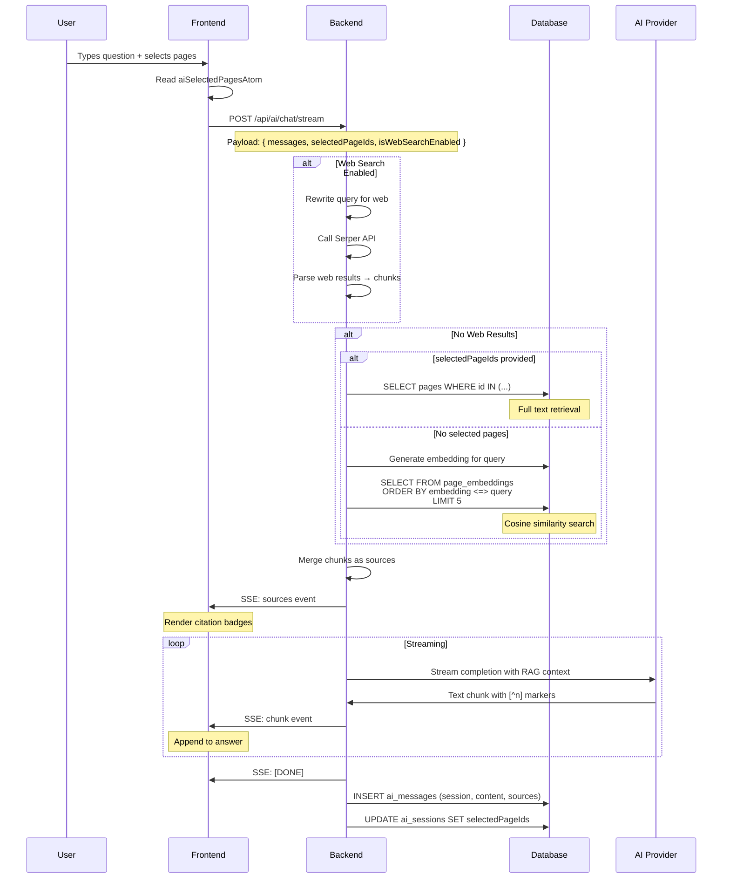

# Intelligence Feature - RAG Mechanism Technical Specification

**Docmost** - Collaborative Wiki & Documentation Software  
**Version:** 1.0  
**Last Updated:** February 22, 2026

---

## Table of Contents

1. [Overview](#overview)
2. [Architecture](#architecture)
3. [Data Flow](#data-flow)
4. [Component Details](#component-details)
5. [State Management](#state-management)
6. [API Specification](#api-specification)
7. [Database Schema](#database-schema)
8. [Embedding Generation](#embedding-generation)
9. [Citation System](#citation-system)
10. [Session Persistence](#session-persistence)

---

## Overview

### Purpose

The Intelligence feature provides AI-powered chat with **Retrieval-Augmented Generation (RAG)** capabilities, enabling users to ask questions and receive answers grounded in their workspace documentation with verifiable citations.

### Key Capabilities

| Feature | Description |
|---------|-------------|
| **Semantic Search** | pgvector-based similarity search across page embeddings |
| **Manual Page Selection** | Users can explicitly select pages as context |
| **Web Search Layer** | Optional Serper API integration for external knowledge |
| **Citation System** | Inline `[^n]` markers with popover previews |
| **Session Persistence** | Chat history and context saved per session |
| **Real-time Streaming** | SSE-based answer streaming with progressive rendering |

---

## Architecture

### High-Level Diagram

```
┌─────────────────────────────────────────────────────────────────────────┐
│                           FRONTEND (React)                               │
├─────────────────────────────────────────────────────────────────────────┤
│  ┌──────────────┐  ┌──────────────┐  ┌──────────────┐                  │
│  │ AiPage.tsx   │  │ AiMessageInput│  │ useAiChat    │                  │
│  │              │  │              │  │ hook         │                  │
│  │ - Session mgmt│  │ - Page picker│  │ - SSE stream │                  │
│  │ - Page restore│  │ - Settings   │  │ - Atoms      │                  │
│  └──────┬───────┘  └──────┬───────┘  └──────┬───────┘                  │
│         │                 │                 │                           │
│         └─────────────────┼─────────────────┘                           │
│                           │                                             │
│                    ┌──────▼───────┐                                     │
│                    │ Jotai Atoms  │                                     │
│                    │ - aiSelectedPagesAtom │                            │
│                    │ - aiSourcesAtom       │                            │
│                    │ - aiActiveSessionAtom │                            │
│                    └──────┬───────┘                                     │
└───────────────────────────┼─────────────────────────────────────────────┘
                            │ HTTP / SSE
┌───────────────────────────▼─────────────────────────────────────────────┐
│                         BACKEND (NestJS)                                 │
├─────────────────────────────────────────────────────────────────────────┤
│  ┌──────────────────────────────────────────────────────────────────┐   │
│  │                    AiController                                   │   │
│  │  POST /api/ai/sessions          - Create session                  │   │
│  │  GET  /api/ai/sessions/:id      - Get session + messages          │   │
│  │  POST /api/ai/chat/stream       - RAG chat (SSE)                  │   │
│  │  POST /api/ai/pages/search      - Search pages by ID/query        │   │
│  └──────────────────────────────────────────────────────────────────┘   │
│                            │                                             │
│         ┌──────────────────┼──────────────────┐                         │
│         ▼                  ▼                  ▼                         │
│  ┌─────────────┐   ┌─────────────┐   ┌─────────────┐                   │
│  │ RagService  │   │ WebSearch   │   │ AiOrchestrator│                 │
│  │             │   │ Service     │   │ (Provider)   │                   │
│  │ - retrieve()│   │ - rewrite() │   │ - LLM call   │                   │
│  │ - pgvector  │   │ - Serper    │   │ - streaming  │                   │
│  └──────┬──────┘   └──────┬──────┘   └──────┬──────┘                   │
│         │                 │                 │                           │
│         └─────────────────┼─────────────────┘                           │
└───────────────────────────┼─────────────────────────────────────────────┘
                            │
┌───────────────────────────▼─────────────────────────────────────────────┐
│                      DATABASE (PostgreSQL + pgvector)                    │
├─────────────────────────────────────────────────────────────────────────┤
│  ┌──────────────┐  ┌──────────────┐  ┌──────────────┐                  │
│  │ ai_sessions  │  │ ai_messages  │  │ page_embeddings│                 │
│  │              │  │              │  │              │                  │
│  │ - id         │  │ - id         │  │ - page_id    │                  │
│  │ - userId     │  │ - sessionId  │  │ - embedding  │  vector(1024)    │
│  │ - selectedPageIds (JSONB)      │  │ - excerpt    │                  │
│  └──────────────┘  └──────────────┘  └──────────────┘                  │
└─────────────────────────────────────────────────────────────────────────┘
```

---

## Data Flow

### Complete RAG Flow



---

## Data Flow Note (Feb 22, 2026)

### Semantic Search Disabled

**Current Behavior:**
The Intelligence feature only uses **explicitly selected pages** as RAG context. Semantic search (`ragService.retrieve()`) is currently **disabled** in the chat flow.

**Why:**
Previously, when no pages were selected, the system would automatically perform semantic search and return top 5 similar pages based on the query. This was determined to be unexpected behavior.

**Future Implementation:**
When semantic search is needed, it should be an **opt-in feature**:

1. Add a toggle/setting like "Auto-search workspace knowledge"  
2. When enabled → perform semantic search (`retrieve()`)
3. When disabled (default) → no RAG context when no pages selected

**Technical Reference:**
- Location: `apps/server/src/ai/ai.controller.ts` - lines ~432-437
- Method: `ragService.retrieve()` uses pgvector cosine similarity
- Returns: Top-K (default 5) similar chunks based on query embedding

---

## Component Details

### Frontend Components

| Component | File | Responsibility |
|-----------|------|----------------|
| `AiPage.tsx` | `apps/client/src/features/ai/pages/` | Main container, session management |
| `AiMessageInput.tsx` | `apps/client/src/features/ai/components/` | Input UI, page picker, settings |
| `useAiChat.ts` | `apps/client/src/features/ai/hooks/` | Chat logic, SSE streaming |
| `useAiSessions.ts` | `apps/client/src/features/ai/hooks/` | Session CRUD operations |
| `useAiPageSearch.ts` | `apps/client/src/features/ai/hooks/` | Page search mutation |
| `ai.atoms.ts` | `apps/client/src/features/ai/store/` | Jotai state atoms |
| `ai-chat.service.ts` | `apps/client/src/features/ai/services/` | SSE event parsing |
| `AiCitationRenderer.tsx` | `apps/client/src/features/ai/components/` | Citation popover rendering |

### Backend Components

| Component | File | Responsibility |
|-----------|------|----------------|
| `AiController` | `apps/server/src/ai/ai.controller.ts` | REST endpoints, SSE streaming |
| `RagService` | `apps/server/src/ai/services/rag.service.ts` | pgvector retrieval |
| `WebSearchService` | `apps/server/src/ai/services/web-search.service.ts` | Serper API integration |
| `AiOrchestratorService` | `apps/server/src/ai/services/ai-orchestrator.service.ts` | Provider routing |
| `AiSessionRepo` | `apps/server/src/ai/repos/ai-session.repo.ts` | Session persistence |
| `AiMessageRepo` | `apps/server/src/ai/repos/ai-message.repo.ts` | Message persistence |
| `PageRepo` | `apps/server/src/database/repos/page/page.repo.ts` | Page queries |

---

## State Management

### Jotai Atoms

```typescript
// apps/client/src/features/ai/store/ai.atoms.ts

// User-selected pages for context (volatile)
export const aiSelectedPagesAtom = atom<AiPageSearchResult[]>([]);

// RAG retrieval results (reset each message)
export const aiSourcesAtom = atom<RagSource[]>([]);

// Current active session
export const aiActiveSessionAtom = atom<AiSession | null>(null);

// Web search toggle (persisted)
export const aiWebSearchEnabledAtom = atomWithStorage<boolean>(
  'docmost_ai_web_search',
  false
);

// Streaming state
export const aiIsStreamingAtom = atom<boolean>(false);
export const aiStreamingContentAtom = atom<string>('');
export const aiStreamingThinkingAtom = atom<string>('');
```

### State Flow for Selected Pages

```
┌─────────────────────────────────────────────────────────────────┐
│                    Selected Pages Lifecycle                      │
├─────────────────────────────────────────────────────────────────┤
│                                                                  │
│  1. User clicks "+" → Opens page picker popover                 │
│  2. User searches → useAiPageSearch.mutate({ query, spaceId })  │
│  3. User selects → setSelectedPages([...prev, page])            │
│  4. User sends message → selectedPageIds sent to backend        │
│  5. Backend saves → ai_sessions.selectedPageIds (JSONB)         │
│  6. User switches session → restoreSelectedPages(session.selectedPageIds)
│  7. User creates new chat → setSelectedPages([])                │
│                                                                  │
└─────────────────────────────────────────────────────────────────┘
```

---

## API Specification

### Session Management

#### Create Session
```http
POST /api/ai/sessions
Content-Type: application/json

{
  "pageId": "uuid-optional"  // Optional context page
}

Response: 200 OK
{
  "session": {
    "id": "uuid",
    "workspaceId": "uuid",
    "userId": "uuid",
    "pageId": "uuid",              -- Optional context page
    "title": "New Chat",
    "selectedPageIds": [],
    "createdAt": "2026-02-22T00:00:00Z",
    "updatedAt": "2026-02-22T00:00:00Z"
  },
  "memories": []  // Mem0 memories if enabled
}
```

#### Get Session with Messages
```http
GET /api/ai/sessions/:id

Response: 200 OK
{
  "session": {
    "id": "uuid",
    "workspaceId": "uuid",
    "userId": "uuid",
    "pageId": "uuid",              -- Optional context page
    "title": "How to deploy...",
    "selectedPageIds": ["page-uuid-1", "page-uuid-2"],
    "createdAt": "2026-02-22T00:00:00Z",
    "updatedAt": "2026-02-22T00:00:00Z"
  },
  "messages": [
    {
      "id": "uuid",
      "role": "user",
      "content": "How do I deploy...",
      "sources": [],
      "createdAt": "2026-02-22T00:00:00Z"
    },
    {
      "id": "uuid",
      "role": "assistant",
      "content": "To deploy... [^1][^2]",
      "sources": [
        {
          "pageId": "uuid",
          "title": "Deployment Guide",
          "slugId": "deployment",
          "spaceSlug": "docs",
          "excerpt": "Deployment steps...",
          "similarity": 0.89
        }
      ],
      "createdAt": "2026-02-22T00:00:01Z"
    }
  ]
}
```

### RAG Chat

#### Stream Chat
```http
POST /api/ai/chat/stream
Content-Type: application/json

{
  "messages": [
    { "role": "user", "content": "How do I configure..." }
  ],
  "sessionId": "uuid",
  "model": "glm-4.7-flash",
  "thinking": false,
  "selectedPageIds": ["uuid-1", "uuid-2"],  // Optional
  "isWebSearchEnabled": true                 // Optional
}

Response: 200 OK (SSE)
Content-Type: text/event-stream

data: {"type":"sources","data":[{"pageId":"uuid","title":"...",...}]}
data: {"type":"memory","data":{"enabled":true,"loaded":true}}
data: {"type":"thinking","data":"Let me analyze..."}
data: {"type":"chunk","data":"To configure..."}
data: {"type":"chunk","data":" [^1][^2]"}
data: [DONE]
```

### Page Search

#### Search Pages
```http
POST /api/ai/pages/search
Content-Type: application/json

{
  "spaceId": "uuid",      // Optional if pageIds provided
  "query": "deployment",  // Optional if pageIds provided
  "pageIds": ["uuid-1"]   // Optional - fetch by IDs
}

Response: 200 OK
[
  {
    "pageId": "uuid",
    "title": "Deployment Guide",
    "slugId": "deployment",
    "spaceId": "uuid",
    "spaceSlug": "docs"
  }
]
```

---

## Database Schema

### ai_sessions
```sql
CREATE TABLE ai_sessions (
  id              UUID PRIMARY KEY DEFAULT gen_random_uuid(),
  workspace_id    UUID NOT NULL REFERENCES workspaces(id),
  user_id         UUID NOT NULL REFERENCES users(id),
  page_id         UUID REFERENCES pages(id),  -- Optional context page
  title           VARCHAR(255) DEFAULT 'New Chat',
  selected_page_ids JSONB DEFAULT '[]',       -- User-selected pages
  created_at      TIMESTAMPTZ DEFAULT NOW(),
  updated_at      TIMESTAMPTZ DEFAULT NOW()
);

CREATE INDEX idx_ai_sessions_workspace_user 
  ON ai_sessions(workspace_id, user_id, updated_at DESC);
```

### ai_messages
```sql
CREATE TABLE ai_messages (
  id              UUID PRIMARY KEY DEFAULT gen_random_uuid(),
  session_id      UUID NOT NULL REFERENCES ai_sessions(id),
  workspace_id    UUID NOT NULL REFERENCES workspaces(id),
  role            VARCHAR(20) NOT NULL CHECK (role IN ('user', 'assistant')),
  content         TEXT NOT NULL,
  sources         JSONB DEFAULT '[]',      -- Citation metadata
  created_at      TIMESTAMPTZ DEFAULT NOW()
);

CREATE INDEX idx_ai_messages_session 
  ON ai_messages(session_id, created_at);
```

### page_embeddings (pgvector)
```sql
CREATE TABLE page_embeddings (
  id              UUID PRIMARY KEY DEFAULT gen_random_uuid(),
  workspace_id    UUID NOT NULL REFERENCES workspaces(id),
  space_id        UUID NOT NULL REFERENCES spaces(id),
  page_id         UUID NOT NULL REFERENCES pages(id),
  chunk_index     INTEGER NOT NULL,
  embedding       vector(1024),            -- pgvector extension
  metadata        JSONB,                   -- excerpt, tokens, etc.
  created_at      TIMESTAMPTZ DEFAULT NOW(),
  updated_at      TIMESTAMPTZ DEFAULT NOW()
);

CREATE INDEX idx_page_embeddings_workspace 
  ON page_embeddings(workspace_id);

-- HNSW index for fast similarity search
CREATE INDEX idx_page_embeddings_vector 
  ON page_embeddings USING hnsw (embedding vector_cosine_ops);
```

---

## Embedding Generation

### Chunking Strategy

Pages are split into overlapping chunks for embedding:

| Parameter | Value |
|-----------|-------|
| Chunk size | 500 tokens |
| Overlap | 50 tokens |
| Embedding model | `embedding-3` (1024 dimensions) |
| Provider | ZhipuAI (OpenAI-compatible) |

### pgvector Query

```sql
SELECT
  pe.page_id       AS "pageId",
  p.title,
  p.slug_id        AS "slugId",
  s.slug           AS "spaceSlug",
  (pe.metadata->>'excerpt')::text AS excerpt,
  1 - (pe.embedding <=> '[0.123,...]'::vector) AS similarity,
  pe.chunk_index   AS "chunkIndex"
FROM page_embeddings pe
INNER JOIN pages p  ON p.id = pe.page_id
INNER JOIN spaces s ON s.id = pe.space_id
WHERE pe.workspace_id = 'workspace-uuid'
  AND p.deleted_at IS NULL
ORDER BY similarity DESC
LIMIT 5;
```

**Similarity metric:** Cosine distance (`1 - (a <=> b)`)

---

## Citation System

### Citation Format

LLM responses include inline markers: `[^1]`, `[^2]`, etc.

**Example:**
```
To deploy your application, you need to configure the environment first.[^1] 
Then run the build command.[^2]
```

### Source Metadata

```typescript
interface RagSource {
  pageId: string;
  title: string;
  slugId: string;        // For URL construction
  spaceSlug: string;     // For URL construction
  excerpt: string;       // Preview text
  similarity: number;    // Relevance score
  chunkIndex: number;
  url?: string;          // Computed on frontend
}
```

### Frontend Rendering

1. **Parse** `[^n]` markers from answer text
2. **Map** to sources from `aiSourcesAtom`
3. **Render** clickable badges inline
4. **Show** popover on click with excerpt + link

---

## Session Persistence

### When Sessions Are Saved

| Event | Action |
|-------|--------|
| User creates session | INSERT `ai_sessions` with `title='New Chat'` |
| User sends message | INSERT `ai_messages` (user + assistant) |
| Message complete | UPDATE `ai_sessions.selectedPageIds` |
| Message complete | UPDATE `ai_sessions.updated_at` (touch) |
| First message sent | POST `/auto-title` → UPDATE `ai_sessions.title` |

### Selected Pages Persistence Flow

```
1. User selects pages → aiSelectedPagesAtom (volatile)
2. User sends message → selectedPageIds in request body
3. Backend receives → RAG uses selected pages
4. Streaming complete → UPDATE ai_sessions SET selectedPageIds = [...]
5. User switches session → SELECT selectedPageIds FROM ai_sessions
6. Frontend restores → setSelectedPages(restoredPages)
```

### Bug Fix (Feb 22, 2026)

**Issue:** Selected pages were cleared when switching sessions but not restored until messages loaded, causing empty badges.

**Fix:** Restore pages immediately from session object instead of waiting for `loadSessionMessages()`:

```typescript
// Before (incorrect)
setSelectedPages([]);
loadSessionMessages(id).then(data => {
  restoreSelectedPages(data.session.selectedPageIds);
});

// After (correct)
if (session.selectedPageIds?.length > 0) {
  restoreSelectedPages(session.selectedPageIds);
} else {
  setSelectedPages([]);
}
loadSessionMessages(id).then(data => {
  // Only load messages, pages already restored
});
```

---

## Configuration

### Environment Variables

```bash
# AI Provider (required)
AI_DRIVER=openai-compatible
OPENAI_COMPATIBLE_BASE_URL=https://open.bigmodel.cn/api/paas/v4
OPENAI_COMPATIBLE_API_KEY=<key>
OPENAI_COMPATIBLE_COMPLETION_MODEL=glm-4-flash
OPENAI_COMPATIBLE_EMBEDDING_MODEL=embedding-3

# Web Search (optional)
SERPER_API_KEY=<key>
SERPER_DEBUG=false

# pgvector (required for RAG)
# PostgreSQL with pgvector extension
```

### Model Configuration

```typescript
// apps/client/src/features/ai/lib/models.config.ts
export const MODEL_CONFIG = {
  'glm-4.7-flash': {
    label: 'GLM-4.7 Flash',
    provider: 'openai-compatible',
    supportsThinking: false,
  },
  'glm-4.5': {
    label: 'GLM-4.5',
    provider: 'openai-compatible',
    supportsThinking: true,
    thinkingModel: 'glm-4.5-thinking',
  },
};
```

---

## Error Handling

### Frontend

| Error | Handling |
|-------|----------|
| SSE connection failed | Display error message in chat |
| Page search fails | Show "No pages found" |
| Restore pages fails | Clear selected pages, log error |

### Backend

| Error | Handling |
|-------|----------|
| AI not configured | Return 503 with message |
| pgvector not available | Fallback to full-text search |
| Web search fails | Log warning, fallback to RAG |
| Session not found | Return 404 |

---

## Testing Checklist

- [ ] Create new session → selected pages empty
- [ ] Select pages → badges appear
- [ ] Send message → RAG uses selected pages
- [ ] Check citations → `[^n]` markers render correctly
- [ ] Switch to another session → pages restore correctly
- [ ] Create new chat → pages cleared
- [ ] Reload page → session pages persist

---

## Related Files

### Frontend
```
apps/client/src/features/ai/
├── pages/
│   └── AiPage.tsx
├── components/
│   ├── AiMessageInput.tsx
│   ├── AiMessageList.tsx
│   ├── AiCitationRenderer.tsx
│   ├── AiSourceDrawer.tsx
│   └── editor/ai-menu/
├── hooks/
│   ├── use-ai-chat.ts
│   ├── use-ai-sessions.ts
│   └── use-ai-page-search.ts
├── store/
│   └── ai.atoms.ts
├── services/
│   ├── ai-chat.service.ts
│   └── ai-search-service.ts
├── types/
│   └── ai-chat.types.ts
└── lib/
    └── models.config.ts
```

### Backend
```
apps/server/src/ai/
├── ai.controller.ts
├── ai.module.ts
├── services/
│   ├── rag.service.ts
│   ├── web-search.service.ts
│   ├── ai-orchestrator.service.ts
│   └── embedding.service.ts
├── repos/
│   ├── ai-session.repo.ts
│   └── ai-message.repo.ts
├── providers/
│   ├── openai.provider.ts
│   ├── gemini.provider.ts
│   └── ollama.provider.ts
├── dto/
│   ├── ai-chat.dto.ts
│   ├── ai-session.dto.ts
│   └── ai-page-search.dto.ts
└── utils/
    └── prompt.utils.ts
```

---

## Glossary

| Term | Definition |
|------|------------|
| **RAG** | Retrieval-Augmented Generation - LLM responses grounded in retrieved documents |
| **pgvector** | PostgreSQL extension for vector similarity search |
| **SSE** | Server-Sent Events - unidirectional real-time communication |
| **HNSW** | Hierarchical Navigable Small World - approximate nearest neighbor algorithm |
| **Mem0** | User memory service for personalized AI context |
| **Serper** | Google Search API provider for web search layer |
