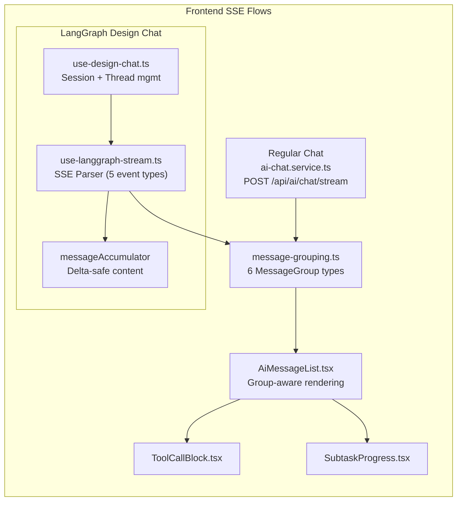

# LangGraph SSE Integration — Current Status

## Overview

The frontend now has a comprehensive LangGraph SSE integration that handles all 5 event types, models tool calls / responses, groups messages for rich UI rendering, and syncs thread state (artifacts, title, todos) back to the session.

---

## Architecture

---

## Files Modified / Created

| File | Type | Purpose |
|------|------|---------|
| [ai-chat.types.ts](file:///Users/zeal/Coding/docmost/apps/client/src/features/ai/types/ai-chat.types.ts) | Modified | [ToolCall](file:///Users/zeal/Coding/docmost/apps/client/src/features/ai/types/ai-chat.types.ts#16-22), [Todo](file:///Users/zeal/Coding/docmost/apps/client/src/features/ai/types/ai-chat.types.ts#23-27), [SubtaskEvent](file:///Users/zeal/Coding/docmost/apps/client/src/features/ai/types/ai-chat.types.ts#28-37) + [AiMessage](file:///Users/zeal/Coding/docmost/apps/client/src/features/ai/types/ai-chat.types.ts#45-61) extended |
| [ai.atoms.ts](file:///Users/zeal/Coding/docmost/apps/client/src/features/ai/store/ai.atoms.ts) | Modified | `aiTodosAtom`, `aiSubtaskProgressAtom` |
| [use-langgraph-stream.ts](file:///Users/zeal/Coding/docmost/apps/client/src/features/ai/hooks/use-langgraph-stream.ts) | Modified | SSE parser — 5 event types, accumulator, backend IDs |
| [use-design-chat.ts](file:///Users/zeal/Coding/docmost/apps/client/src/features/ai/hooks/use-design-chat.ts) | Modified | Title sync, todos sync, subtask progress, backend IDs |
| [AiMessageList.tsx](file:///Users/zeal/Coding/docmost/apps/client/src/features/ai/components/AiMessageList.tsx) | Modified | Group-aware rendering with 6 group types |
| [AiMessageList.module.css](file:///Users/zeal/Coding/docmost/apps/client/src/features/ai/components/AiMessageList.module.css) | Modified | `.fileChip`, `.clarificationBadge` styles |
| [artifacts-context.tsx](file:///Users/zeal/Coding/docmost/apps/client/src/features/ai/context/artifacts-context.tsx) | Modified | Fixed `artifactPanelOpen` |
| [message-grouping.ts](file:///Users/zeal/Coding/docmost/apps/client/src/features/ai/lib/message-grouping.ts) | **New** | [groupMessages()](file:///Users/zeal/Coding/docmost/apps/client/src/features/ai/lib/message-grouping.ts#70-191) → 6 [MessageGroup](file:///Users/zeal/Coding/docmost/apps/client/src/features/ai/lib/message-grouping.ts#60-67) types |
| [ToolCallBlock.tsx](file:///Users/zeal/Coding/docmost/apps/client/src/features/ai/components/ToolCallBlock.tsx) | **New** | Collapsible tool call display |
| [ToolCallBlock.module.css](file:///Users/zeal/Coding/docmost/apps/client/src/features/ai/components/ToolCallBlock.module.css) | **New** | Dark-theme styling |
| [SubtaskProgress.tsx](file:///Users/zeal/Coding/docmost/apps/client/src/features/ai/components/SubtaskProgress.tsx) | **New** | Real-time subtask progress |
| [SubtaskProgress.module.css](file:///Users/zeal/Coding/docmost/apps/client/src/features/ai/components/SubtaskProgress.module.css) | **New** | Dark-theme styling |

---

## SSE Event Handling

| Event Type | stream_mode | Status | How Handled |
|------------|-------------|--------|-------------|
| `values` | ✅ Subscribed | ✅ Done | Extracts `artifacts`, `title`, `todos`, `messages`. Overwrites `messageAccumulator`. |
| `messages-tuple` | ✅ Subscribed | ✅ Done | Parses `[id, payload]` tuples. Appends delta to `messageAccumulator`. |
| `messages` | Backward compat | ✅ Done | Appends delta to `messageAccumulator`. |
| `custom` | ✅ Subscribed | ✅ Done | Dispatches [SubtaskEvent](file:///Users/zeal/Coding/docmost/apps/client/src/features/ai/types/ai-chat.types.ts#28-37) → `aiSubtaskProgressAtom` → [SubtaskProgress](file:///Users/zeal/Coding/docmost/apps/client/src/features/ai/components/SubtaskProgress.tsx#7-33) UI |
| [end](file:///Users/zeal/Coding/docmost/apps/client/src/features/ai/components/AiMessageList.tsx#180-210) | — | ✅ Done | Recognized in event parser |

---

## Review Report Scorecard

| # | Item | Status |
|---|------|--------|
| 1 | `stream_mode` — `messages-tuple` + `custom` | ✅ Done |
| 2 | `custom` event → subtask progress | ✅ Done |
| 3 | [end](file:///Users/zeal/Coding/docmost/apps/client/src/features/ai/components/AiMessageList.tsx#180-210) event handling | ✅ Done |
| 4 | [LangGraphState](file:///Users/zeal/Coding/docmost/apps/client/src/features/ai/hooks/use-langgraph-stream.ts#14-24) — `todos`, `uploaded_files`, `viewed_images` | ⚠️ Partial (see pending) |
| 5 | Message type model — `tool_calls`, `tool_result` | ✅ Done |
| 6 | Message grouping — 6 [MessageGroup](file:///Users/zeal/Coding/docmost/apps/client/src/features/ai/lib/message-grouping.ts#60-67) types | ✅ Done |
| 7 | `title` sync to session | ✅ Done |
| 8 | [onMessage](file:///Users/zeal/Coding/docmost/apps/client/src/features/ai/hooks/use-design-chat.ts#42-46) overwrite → delta-safe accumulation | ✅ Done |
| 9 | Hardcoded configs — `subagent_enabled`, `model_name` | ✅ Resolved (model in backend) |
| 10 | Artifact panel hardcoded open | ✅ Fixed |
| 11 | Clarification flag never resets | ✅ Fixed (`Set<string>`) |
| 12 | Error `detail` parsing | ✅ Done |
| 13 | `uploaded_files` / `viewed_images` support | 🔜 Next stage |
| 14 | Backend message IDs | ✅ Done (`lastMessageId`) |

**12 of 14 items complete. 2 deferred to next stage.**

---

## Pending Items (Next Stage)

| Priority | Item | Details |
|----------|------|---------|
| 🟡 Medium | `uploaded_files` extraction | Typed in [LangGraphState](file:///Users/zeal/Coding/docmost/apps/client/src/features/ai/hooks/use-langgraph-stream.ts#14-24) but not extracted from `values` events. Needs a new atom + UI to display agent-uploaded files. |
| 🟡 Medium | `viewed_images` extraction | Typed in [LangGraphState](file:///Users/zeal/Coding/docmost/apps/client/src/features/ai/hooks/use-langgraph-stream.ts#14-24) but not extracted from `values` events. Needs a new atom + UI to display agent-viewed images. |
| 🟢 Low | `is_plan_mode` toggle | Hardcoded to `true`. Could add a UI toggle in `AiMessageInput` to let users switch between plan/direct mode. |
| 🟢 Low | Manual end-to-end testing | All changes compile but haven't been tested against a live LangGraph backend. |
